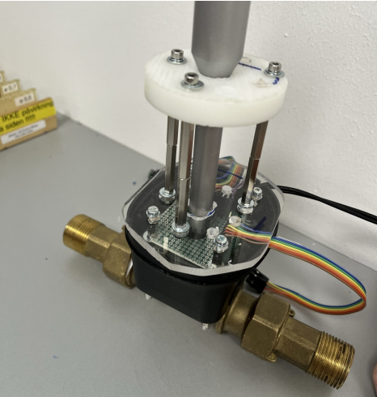

# 🚰 Leak Detection in Smart Water Meters  
Proof-of-concept for detecting water pipe leaks using sensor signals and machine learning.

## 🧾 Abstract  
The project examines how the smart water meter Ultrimis-W can implement water leakage detection (secondary leakage localization) under circumstances found in modern water distribution, based on existing knowledge about leak detection. Data is collected from a measurement setup in a series of sensors (Measurement microphone, MEMS microphone, piezo tranducers, accelerometer), from which time series are analyzed both in the time- and frequency domain, as well as the leakages impact on relevant features are examined. A set of features is selected which is used to train 4 machine learning models, which are evaluated in relation to, among other things, influence of different amounts of noise. Based on estimates of power consumption, the models are compared to finally outline a possible frameworks for a practical implementation.

## 📂 Project Files  
- 📄 PDF Thesis (Confidential – Not Public)  
- 📓 Notebooks and Analysis Scripts (Not Published)  

## 🔍 Highlights  
- 🧪 Physical test setup simulating different leak sizes and distances  
- 🎤 Multi-sensor data collection: reference microphone, MEMS mic, accelerometer, piezo transducers  
- 📊 Signal processing in both time and frequency domains  
- 🤖 ML models: Linear Regression, SVM, Decision Tree, and RISE  
- 🏆 Best performance from Decision Tree and RISE (F1-score = 1.00)  
- 🔋 Energy trade-off analysis between on-device FFT and raw signal transmission

## 📷 Preview  

  
    
  
<i>Fig 2: Measurement setup with configurable leak size and isolated sensor chamber</i>
  

  

<table>
  <tr>
    <td align="center">
       
      <i>Fig 6a: Sketch of modified Ultrimis-W smart water meter with embedded sensors</i>
    </td>
    <td align="center">
       
      <i>Fig 6b: Real-world implementation of the sensor-modified water meter</i>
    </td>
  </tr>
</table>

  
    
  
<i>Fig 40: Frequency bin selection and spectrum layout used for feature extraction</i>
  

  

## 📌 Key Insight  
Using internal sensor data from a modified water meter, even small pipe leaks can be detected up to 10 meters away. A Decision Tree classifier using just one FFT bin achieved excellent results, while the RISE model offered robust detection with as few as 172 time-domain samples. These models can operate within the low-power budget of embedded devices, making real-world deployment feasible.